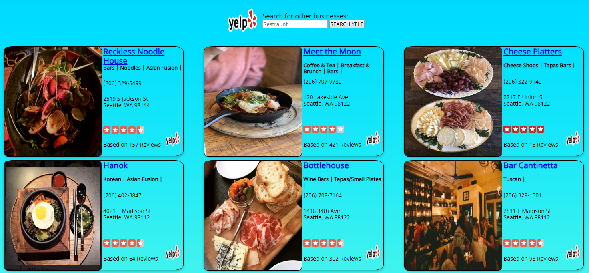

# City Small Talk

Web app to give users information about the news, weather, and restaurant recommendations in different cities across America.

[TRY THE APP](https://wysocki129.github.io/City-Small-Talk/)

## Screenshots

## Summary

This project was developed while I was working on my Bloc mobile developer bootcamp. I use the NewsAPI, Open Weather Map API, and the Yelp Fusion API to find simple small talk topics for cities across America.

## Technologies Used

* HTML
* CSS
* JS
* JQuery
* Yelp Fusion API
* Open Weather Map API
* News API